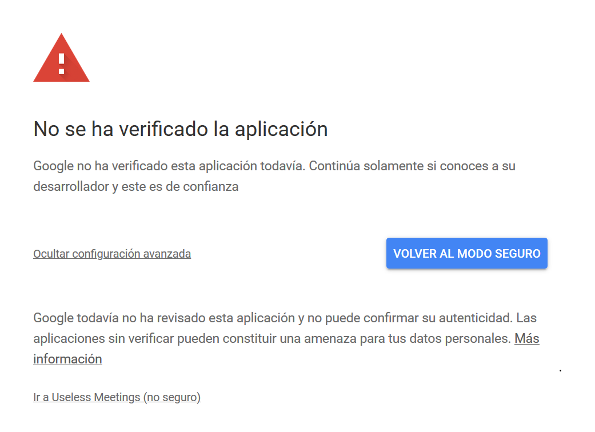

# Google Calendar API Demo Using FLASK

This very simple application - with missing front-end to be published - can be useful for anyone who wish to use: 
* Google Calendar API
* FLASK

## How does it do 

This applicatoon will fetch your **confirmed** events from your Google Calendar and based on two inputs you need to give (your salary and the number of hours you work per week), it will return the amount of your salary which is allocated to these meetings. 

The application is not very useful and has several flaws, but it was initially design to help me get a grasp at the Calendar API and FLASK, which is a simple back-end framework for Python application. 

## Instructions - Before even launching the application

* Clone the repository 
* Go to the [Google Developers Console](https://console.developers.google.com/) and create a new project (the name doesn't really matter) 
* Enable the Google Calendar API by searchinf for its name in the search bar at the top of the page and clicking on "Enable API" 
* Create a Oauth2 credentials clicking on the Credentials element located in the sidebar on the left of the screen. If this is the first time you create a credential, you may have to create a consent screen as well. 
* Download the client_secrets.json file linked to these credentials
* Include the file in the main project folder (remember to update its name)

## Instructions - Launching the application

* Install all the dependencies you need (Flask and all libraries listed in the get_events.py file). 
* Open your terminal and cd to the project folder
* Type python main.py 
* Open the URL displayed by the terminal in your browser. It should look like http://127.0.0.1:5000/ 
* At this stage, you should be seeing a simple form with two input fields asking for your salary and your weekly worked hours. The form only accept integrals. 

## Instructions - Using the application 

* Introduce whatever number in the two input fields and clisk on Submit
* At this point, you should follow the usual steps to allow an external service to access your information. As the scope of the API included in the get_events.py file is https://www.googleapis.com/auth/calendar.events.readonly, the application will just ask for read-only right. 
* If you haven't verified the application in the Google Developer Console, you will see this screen: don't worry and click to "Go to xxxx". My laptop is is Spanish, so the message is displayed in this language. 

* Once you go through the whole process, go back to the application: it should have realoaded and display the amount of your salary that went to meetings on average based on data since the beginning of the year

## Flaws 

This application is not aimed to be published like this, as you surely have noticed. Hence, there are a lot of flaws. Some of them to name just a few: 

* No decent front-end 
* Application is not verified 
* The application doesn't handle events out of business hours 
* The application doesn't handle cases where you have more than one meeting at the same time 

Nevertheless, this was a good introduction for me on how to build a really simple application, using an API and without using external libraries (except the one included in Google's own recommandations). 
